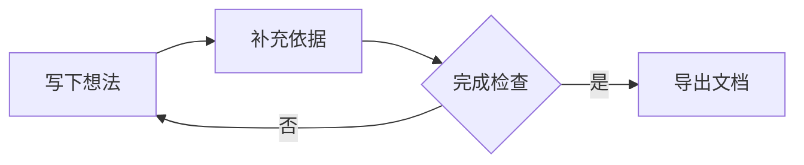

# Markdown高级语法

[TOC]

## 行内内容

把 ==关键结论== 标出来。公式可以写成 $E=mc^2$，也可以使用 \(a^2+b^2=c^2\)。`$5 and $10` 这样的价格文字按原文保留。

这里有一条命名脚注[^说明]，后面可以再次引用[^说明]。也可以直接写一条行内脚注^[这条说明直接写在引用的位置，支持 **粗体** 和 $x^2$。]。

- [x] 写下结论
- [ ] 检查引用[^说明]

## 提示块

> [!tip]+ 使用提示
> 点击标题可以折叠或展开。标题和正文均支持 **样式**、==高亮== 和公式 $x+y$。
>
> > [!warning]- 进一步说明
> > 提示块可以嵌套；末尾的 `-` 表示默认折叠。

## 表格中的内容

| 项目 | 表达式 | 说明 |
| :--- | :---: | ---: |
| 平方 | $x^2$ | [^说明] |
| 开方 | $\sqrt{x}$ | 行内脚注^[表格里的脚注与全文共用编号和回链。] |

## 块级公式

$$
\sum_{i=1}^{n} i = \frac{n(n+1)}{2}
$$

## Mermaid 图表

## 继续编辑

切换编辑与阅读模式，尝试点击脚注编号和回链、折叠提示块，或修改公式与图表源码。源码写错时会保留原文并显示错误，修正后恢复预览。

[^说明]: 脚注定义保留为可编辑源码，阅读时集中显示在文末。重复引用共用编号，每处引用都有独立回链。
