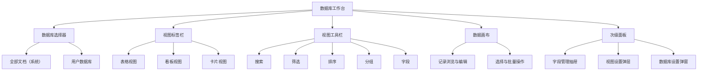

# KnowBook 数据库工作台重构设计

> 文档状态：已实施  
> 适用版本：KnowBook 0.1.x 后续版本  
> 最后更新：2026-08-25  
> 目标读者：产品、设计、Renderer/Main 开发、测试

## 1. 执行摘要

数据库页面应从“数据库结构管理后台”重构为“结构化知识工作台”。用户进入页面后的第一任务应是查看、筛选、组织和编辑数据，而不是管理列、实体或底层数据库类型。

本设计确定以下方向：

1. 将当前“文档目录”和“独立数据库”统一为一个数据库选择器。
2. 将“全部文档”定义为系统数据库，用户创建的数据库定义为自定义数据库。
3. 将表格、看板和卡片定义为同一数据库的不同视图，互相切换，不再同时纵向堆叠。
4. 将搜索、筛选、排序、分组和字段显隐集中到统一视图工具栏。
5. 将字段创建、改名、排序、选项维护和删除移入字段管理抽屉，不再常驻主画面。
6. 将新建记录提升为主操作；数据库和字段管理降为次级操作。
7. 先在 Renderer 层统一产品模型，再分阶段演进保存视图、记录标题和查询 API，避免一次性重写 SQLite 领域层。

重构完成后，用户看到的应是一份可以每天使用的数据视图，而不是数据库实现细节。

## 2. 背景与问题

### 2.1 当前能力

当前数据库页面已经具备以下能力：

- 默认文档目录：全部文档、用户自定义字段、表格内联编辑、按父级或字段分组的看板。
- 独立数据库：自定义字段、实体记录、可选关联文档、卡片/表格、搜索、单字段范围过滤、创建/更新时间排序、保存视图和批量操作。
- 共享字段类型：Text、Select、Multi-select、Date、Checkbox。
- 数据由 SQLite 持久化，Renderer 通过 `window.knowbook` IPC API 读写。

### 2.2 当前页面的问题

#### 产品定位混乱

页面同时承担数据浏览、字段设置、数据库管理、看板展示和批量编辑。用户无法快速判断这里主要是“看数据”还是“配置数据库”。

#### 技术概念暴露

“文档目录”和“独立数据库”描述的是实现差异，不是用户目标。用户需要理解两套模式后才能决定从哪里开始。

#### 低频操作抢占首屏

字段卡片将左移、右移、删除等结构管理操作永久放在首屏。字段越多，数据区域越靠后，视觉噪声越大。

#### 视图关系错误

表格与看板是同一数据源的两种呈现方式，但当前文档目录将两者上下堆叠。页面过长，也无法形成“保存一套视图配置”的一致心智模型。

#### 主操作不符合日常任务

“新增列”比“新增记录”更突出。日常访问的搜索、过滤、排序、打开文档没有形成一条稳定操作路径。

#### 两套 Renderer 分支持续膨胀

`DatabaseSection.tsx` 同时维护 catalog 和 standalone 两个大型分支。交互能力、空状态、工具栏和测试逐渐重复，但又不能共享。

### 2.3 本次设计与前一版视觉优化的关系

前一版视觉优化解决了间距、层级、横向滚动和表格密度，但没有改变信息架构。本设计是后续结构性重构的依据。实现时可以复用已经建立的颜色、圆角、表格密度和响应式样式，但不应以现有 DOM 结构为约束。

## 3. 产品定位

### 3.1 一句话定义

> 数据库工作台是使用结构化字段和可保存视图组织知识与记录的地方。

### 3.2 用户进入页面要完成的核心任务

按频率排序：

1. 查看某个数据库中的记录。
2. 搜索、筛选、排序或分组记录。
3. 切换表格、看板或卡片视图。
4. 快速编辑字段值。
5. 打开关联文档或创建新记录。
6. 保存当前视图供以后复用。
7. 批量处理选中记录。
8. 创建或维护字段。
9. 创建、重命名或删除数据库。

### 3.3 非目标

本轮不将 KnowBook 扩展为通用关系数据库产品，以下能力不进入首轮实现：

- 公式、Rollup、跨数据库 Relation。
- SQL 查询编辑器。
- 多人实时协作和权限系统。
- 云端同步和分享视图。
- 任意类型的 Dashboard 图表。
- 用户自定义自动化工作流。

这些能力未来可以演进，但不应阻塞当前工作台重构。

## 4. 统一概念模型

### 4.1 术语

| 术语 | 定义 | 示例 |
| --- | --- | --- |
| 数据库 | 一组结构一致的记录 | 全部文档、项目管理、阅读清单 |
| 系统数据库 | 由 KnowBook 维护、每行对应一篇文档的数据库 | 全部文档 |
| 自定义数据库 | 用户创建、每行是独立记录且可关联文档的数据库 | 项目管理 |
| 字段 | 记录的结构化属性 | 状态、负责人、发布日期 |
| 记录 | 数据库中的一行或一张卡片 | 一篇文档、一个项目 |
| 视图 | 数据库的一套呈现和查询配置 | 全部、进行中、按状态看板 |
| 布局 | 视图的呈现方式 | 表格、看板、卡片 |

用户界面中不再使用“文档目录”和“独立数据库”作为一级模式名称。必要的实现差异只体现在操作规则和帮助文案中。

### 4.2 当前概念到目标概念的映射

| 当前概念 | 目标概念 | 迁移方式 |
| --- | --- | --- |
| 文档目录 | 系统数据库“全部文档” | 保留现有默认数据库 ID 和字段数据 |
| 独立 Database | 自定义数据库 | 保留数据库、实体和字段数据 |
| Table | 表格视图 | 转为视图布局 |
| Board | 看板视图 | 转为视图布局，不再单独占用页面 |
| Cards | 卡片视图 | 转为视图布局 |
| 已保存视图 | 视图 | 扩充保存的配置范围 |
| 数据库列 | 字段 | UI 文案统一，底层类型可暂时保留 |
| 数据库实体 | 记录 | UI 文案统一，底层类型可暂时保留 |

### 4.3 必须保持的差异

统一心智模型不意味着抹平业务差异：

- “全部文档”的每条记录必须关联文档，点击标题打开文档编辑器。
- “全部文档”不能删除，标题、路径、块数等系统字段不能删除。
- 自定义数据库记录可以不关联文档。
- 自定义数据库可以删除，但必须经过明确确认。
- 在“全部文档”中新建记录等价于新建文档。
- 在自定义数据库中新建记录等价于新建实体，可在创建时选择关联文档。

## 5. 设计原则

### 5.1 数据优先

首屏空间优先展示记录和视图操作。字段结构和数据库管理按需出现。

### 5.2 渐进披露

常用操作直接可见，复杂或危险操作进入抽屉、弹窗和更多菜单。

### 5.3 一个数据源，多种视图

表格、看板、卡片共享一套筛选、排序、字段和保存逻辑；切换布局只替换内容画布。

### 5.4 本地优先、即时反馈

编辑应立即在 UI 中反馈，再通过 IPC 持久化；失败时回滚并给出明确错误。不得引入依赖云端的交互。

### 5.5 默认简单，高级能力可发现

首次进入只展示一个默认表格视图。筛选、排序、分组和字段设置可以发现，但不强迫用户配置。

### 5.6 统一但不虚假

Renderer 可以提供统一组件和术语，但系统数据库和自定义数据库的能力差异必须通过禁用状态、帮助文案和菜单项准确表达。

## 6. 信息架构



### 6.1 页面层级

页面从上到下固定为四层：

1. 数据库页头：当前数据库身份和新建记录。
2. 视图标签栏：选择或管理保存视图。
3. 视图工具栏：调整当前视图配置。
4. 数据画布：表格、看板或卡片，只出现一种布局。

字段管理和数据库设置以覆盖层出现，不进入正常文档流。

## 7. 页面布局

### 7.1 桌面端主界面

```text
┌────────────────────────────────────────────────────────────────────────┐
│  [数据库图标] 全部文档 ▾                              ＋ 新建文档  ··· │
│              工作区中的全部文档，可使用字段进行分类和组织             │
├────────────────────────────────────────────────────────────────────────┤
│  全部文档    最近剪藏    按状态看板    ＋ 新建视图                     │
├────────────────────────────────────────────────────────────────────────┤
│  🔍 搜索   筛选 2   排序   分组   字段 8         50 条记录   保存更改  │
├────────────────────────────────────────────────────────────────────────┤
│  □  标题              状态       来源       作者        更新时间       │
│  □  OpenCode 重写     已归档     InfoQ      Tina        2026-08-24   │
│  □  大数据教程        阅读中     GitHub     —           2026-08-18   │
│  □  Roadmap           待处理     —          —           2026-08-12   │
│                                                                        │
│                         主数据画布                                     │
└────────────────────────────────────────────────────────────────────────┘
```

### 7.2 字段管理抽屉

```text
                                              ┌─────────────────────────┐
                                              │ 字段管理            ×  │
                                              │ 显示 8 / 共 12 个字段   │
                                              ├─────────────────────────┤
                                              │ ☰ 标题       系统·文本  │
                                              │ ☰ 状态       单选    ···│
                                              │ ☰ 来源站点   文本    ···│
                                              │ ☰ 剪藏时间   日期    ···│
                                              │                         │
                                              │ ＋ 新增字段              │
                                              └─────────────────────────┘
```

抽屉宽度建议为 `320–380px`。打开抽屉时主画布保持当前滚动位置，宽屏下并排缩窄，窄屏下覆盖显示。

### 7.3 窄屏与小窗口

Electron 窗口小于 `900px` 时：

- 页头允许换行，数据库选择器和新建按钮仍保持可见。
- 视图标签栏横向滚动。
- 工具栏保留搜索、筛选和更多按钮；排序、分组、字段收进更多菜单。
- 表格保持最小列宽并在自身容器横向滚动，不撑开页面。
- 字段管理抽屉覆盖整个内容区，但保留明确关闭按钮。
- 看板列横向滚动，不压缩到不可读宽度。

不为数据库工作台设计手机级单列编辑体验；目标下限是可用的小型桌面窗口。

## 8. 核心交互

### 8.1 进入数据库页面

默认行为：

1. 打开上次访问的数据库；不存在记录时回退到“全部文档”。
2. 打开该数据库上次使用的视图；视图失效时回退到第一个可用视图。
3. 首次使用时自动提供一个“全部”表格视图。
4. 页面加载使用结构一致的骨架屏，不先显示空状态再跳变。

“上次访问”仅保存在本地设置，不属于备份所需的业务数据。

### 8.2 切换数据库

点击页头数据库名称打开选择器：

- 第一项固定为“全部文档”，标记“系统”。
- 下面按最近使用或名称展示自定义数据库。
- 提供数据库搜索。
- 底部提供“新建数据库”。
- 自定义数据库右侧菜单包含重命名、编辑描述和删除。
- 系统数据库菜单不包含删除。

切换后清除当前记录选择，恢复目标数据库的上次视图和滚动位置。

### 8.3 新建记录

主按钮文案随数据库类型变化：

- 系统数据库：“新建文档”。创建后直接进入文档编辑器。
- 自定义数据库：“新建记录”。打开轻量创建弹窗。

自定义记录创建弹窗包含：

- 必填标题。
- 可选关联文档。
- 当前视图中可见的可编辑字段。
- “创建并继续添加”辅助操作。

创建成功后记录进入当前视图；若不满足当前筛选条件，需要提示“记录已创建，但不符合当前视图筛选条件”，并提供查看入口。

### 8.4 打开与编辑记录

- 点击系统数据库记录标题：进入文档编辑器。
- 点击自定义记录标题：打开记录详情抽屉。
- `Ctrl/Cmd + Enter`：在新页面语义下打开关联文档；桌面应用当前没有多标签能力时，可等同普通打开。
- 表格字段单击进入编辑；`Enter` 提交，`Escape` 取消。
- Select/Multi-select 使用浮层选项器，不在表格中渲染原生多行 select。
- Checkbox 单击立即保存。
- Date 使用日期输入或日期选择浮层。
- 保存失败时恢复原值，并在字段附近显示错误，同时保留页面级消息。

### 8.5 视图标签

每个标签代表一个已保存视图，标签只显示名称和布局图标。

操作规则：

- 单击切换视图。
- 双击或菜单重命名。
- 拖拽调整视图顺序。
- `＋ 新建视图` 打开创建菜单：表格、看板、卡片。
- 当前配置发生变化后显示未保存圆点，并在工具栏提供“保存更改”。
- “另存为新视图”放入保存按钮菜单。
- 删除视图需要确认；数据库至少保留一个视图。

### 8.6 搜索、筛选、排序与分组

#### 搜索

- 默认搜索标题和当前可搜索字段。
- 输入采用短防抖。
- 搜索词属于视图临时状态；用户保存视图时一并保存。
- 清空按钮必须在有输入时可见。

#### 筛选

目标模型支持多条件组合：

- 第一阶段只实现同组 `AND`。
- 数据结构预留 `AND/OR` 嵌套组，但 UI 可后续开放。
- 每条规则由字段、操作符和值组成。
- 操作符随字段类型变化，例如包含、等于、为空、早于、已勾选。

字段类型与首轮操作符：

| 字段类型 | 操作符 |
| --- | --- |
| Text | 包含、不包含、等于、不等于、为空、不为空 |
| Select | 是、不是、为空、不为空 |
| Multi-select | 包含任一、包含全部、不包含、为空、不为空 |
| Date | 是、早于、晚于、在范围内、为空、不为空 |
| Checkbox | 已勾选、未勾选 |
| 系统计数字段 | 等于、大于、小于 |
| 标题/路径 | 包含、不包含、等于、不等于 |

#### 排序

- 支持多个排序规则，按列表顺序生效。
- 系统字段和用户字段均可排序。
- 默认排序：系统数据库按最近更新，自定义数据库按最近更新。

#### 分组

- 表格可以按字段分组折叠。
- 看板必须选择一个可分组字段。
- 支持 Select、Multi-select、Checkbox、Date、Text 和父级等现有能力。
- Multi-select 记录可以出现在多个看板列，拖拽时遵循现有追加/移除语义。

### 8.7 字段管理

点击“字段”打开抽屉。抽屉承担以下操作：

- 显示或隐藏字段。
- 拖拽调整当前视图字段顺序。
- 新增字段。
- 重命名字段。
- 修改 Select/Multi-select 选项。
- 删除字段。

需要区分两个排序概念：

- 数据库字段顺序：字段的默认顺序，影响新视图。
- 视图字段顺序：只影响当前视图。

默认在抽屉中调整视图字段顺序；字段菜单提供“设为数据库默认顺序”。避免用户为了调整一个视图而改变所有视图。

系统字段规则：

- 标题始终存在且不能删除。
- 路径、块数、链接数、子文档数、更新时间属于只读系统字段。
- 系统字段可以在视图中隐藏，标题除外。
- 用户字段可编辑、隐藏和删除。
- 删除字段必须明确提示已有值会一并删除。

### 8.8 批量操作

未选择记录时不显示批量工具栏。选择后在视图工具栏下方显示上下文操作条：

- 已选数量。
- 全选当前可见记录。
- 清除选择。
- 批量设置字段。
- 清空字段。
- 解除关联文档（仅自定义数据库）。
- 删除记录（仅允许删除的记录类型）。

切换数据库或视图时清除选择。筛选变化后，已经不可见的记录默认退出选择，避免误操作隐藏记录。

### 8.9 危险操作

数据库删除、字段删除、视图删除和批量删除统一使用应用内确认弹窗，不继续依赖浏览器原生 `confirm`。

确认弹窗必须说明：

- 删除对象名称。
- 会连带删除的数据。
- 是否可以从 Markdown 备份恢复。
- 主按钮使用危险色并重复动作名称。

系统数据库不提供删除入口。

## 9. 三种视图布局

### 9.1 表格视图

表格是默认和高密度布局。

要求：

- 标题列固定在左侧。
- 表头保持可见。
- 数据区域独立进行横向和纵向滚动。
- 使用行虚拟化；记录量较大后再评估列虚拟化。
- 列宽可拖拽，双击分隔线自适应内容。
- 空值显示为轻量 `—`，悬停或聚焦后显示添加入口。
- 行悬停显示次级操作，不永久占用一列。
- 系统只读字段使用低强调样式。

### 9.2 看板视图

看板用于基于状态或分类推进工作。

要求：

- 看板替换表格画布，不与表格同时展示。
- 顶部显示当前分组字段和未分组记录数。
- 列宽保持在 `260–320px`，整体横向滚动。
- 卡片只展示标题和当前视图选定的 2–4 个摘要字段。
- 拖拽更新分组字段，失败时卡片回到原列。
- 大量记录时每列独立增量渲染或虚拟化。

### 9.3 卡片视图

卡片适合自定义数据库中的逐条浏览和轻量编辑。

要求：

- 使用响应式网格，不再使用一条记录占满整行的大表单卡。
- 默认卡片只读展示；点击打开详情抽屉编辑。
- 卡片显示标题、关联文档和视图选定字段。
- 批量选择采用卡片左上角复选框。
- 系统数据库可以支持卡片视图，但不作为首轮必需能力。

## 10. 状态、反馈与空状态

### 10.1 加载状态

- 页头、标签栏、工具栏和画布分别使用骨架占位。
- 切换视图时保留旧画布并显示轻量加载状态，避免整页闪白。
- 后台保存不阻塞继续浏览；同一字段的连续写入需要合并或按顺序提交。

### 10.2 空状态矩阵

| 状态 | 主文案 | 主操作 |
| --- | --- | --- |
| 没有自定义数据库 | 创建第一个数据库来组织项目或资料 | 新建数据库 |
| 数据库没有记录 | 这里还没有记录 | 新建记录 |
| 系统数据库没有文档 | 创建第一篇文档开始使用 KnowBook | 新建文档 |
| 没有自定义字段 | 可以用字段为记录添加状态、日期等信息 | 新增字段 |
| 筛选无结果 | 没有记录符合当前条件 | 清除筛选 |
| 搜索无结果 | 未找到匹配记录 | 清空搜索 |
| 看板无法分组 | 当前数据库没有可用于看板分组的字段 | 新增单选字段 |

空状态不重复显示。例如数据库为空时，不再同时显示“无字段”和“无记录”两组大面积提示。

### 10.3 错误状态

- 页面加载失败：画布显示重试入口，页头仍可切换数据库。
- 单字段保存失败：原位错误和回滚。
- 批量操作部分失败：主进程应保证事务原子性，Renderer 只处理全部成功或全部失败。
- 当前视图配置失效：忽略无效字段规则，显示“视图已自动修复”，允许保存修复结果。

## 11. 文案与视觉规范

### 11.1 文案统一

| 旧文案 | 新文案 |
| --- | --- |
| Database | 数据库 |
| 文档目录 | 全部文档 |
| 独立数据库 | 自定义数据库（仅在帮助文案使用） |
| 新增列 | 新增字段 |
| 实体 | 记录 |
| Cards / Table | 卡片 / 表格 |
| 当前未保存视图 | 临时视图或未保存更改 |

用户可见文案使用自然中文，避免 `database`、`schema`、`catalog` 和 `entity` 混排。英文界面仍使用 Database、Field、Record、View 等对应产品术语。

### 11.2 视觉层级

- 页面背景使用当前应用浅灰画布。
- 数据库页头不使用大面积装饰卡片，保持工具型页面密度。
- 主按钮每个层级最多一个。
- 视图标签使用轻量下划线或实体标签，不与主按钮争夺强调。
- 工具栏按钮默认中性，激活筛选时使用强调色和数量标记。
- 表格边界使用细分割线，避免每个单元格成为独立输入框。
- 危险色只用于删除及不可逆动作。
- 字段类型使用小型类型图标或标签，不使用大块彩色卡片。

### 11.3 动效

- 抽屉和弹层使用 `120–180ms` 过渡。
- 表格编辑不使用位移动画。
- 看板拖拽提供清晰占位反馈。
- 遵守 `prefers-reduced-motion`。

## 12. 键盘与无障碍

### 12.1 键盘规则

| 按键 | 行为 |
| --- | --- |
| `/` | 非编辑状态下聚焦数据库搜索 |
| `Enter` | 打开记录或提交当前单元格 |
| `Escape` | 取消编辑、关闭弹层或清除当前临时状态 |
| `Tab / Shift+Tab` | 在可编辑单元格之间移动 |
| `Arrow` | 视图标签或选项器内移动 |
| `Space` | 切换复选框或选中记录 |
| `Ctrl/Cmd + Enter` | 创建记录弹窗中创建并关闭 |

全局快捷键优先级保持现有规则；输入框内不得劫持文本输入所需按键。

### 12.2 无障碍要求

- 数据库选择器、视图标签和布局切换使用正确的 combobox/tab/toolbar 语义。
- 图标按钮必须有本地化可访问名称。
- 颜色不是表达选中、错误和字段类型的唯一方式。
- 焦点样式在表格和抽屉中持续可见。
- 表格单元格编辑前后保持可预测焦点。
- 弹窗和抽屉需要焦点锁定，关闭后焦点返回触发按钮。
- 虚拟化记录仍需提供稳定的行标签和可访问名称。

## 13. 目标领域模型

### 13.1 Renderer 统一投影

Renderer 不应继续直接围绕 `DocumentCatalogEntry` 和 `DatabaseEntity` 构造两套页面。新增统一的展示模型：

```ts
type DatabaseSourceKind = 'document-catalog' | 'custom'

interface DatabaseSource {
  id: string
  kind: DatabaseSourceKind
  name: string
  description: string
  canDelete: boolean
  canCreateDetachedRecord: boolean
}

type DatabaseFieldRole = 'title' | 'property' | 'system'

interface DatabaseField {
  id: string
  name: string
  type: DocumentDatabaseColumnType
  role: DatabaseFieldRole
  options: string[]
  editable: boolean
  hideable: boolean
  deletable: boolean
}

interface DatabaseRecord {
  id: string
  databaseId: string
  title: string
  documentId: string | null
  fieldValues: Record<string, DocumentDatabaseFieldValue>
  createdAt: string
  updatedAt: string
}
```

系统字段使用保留 ID，例如：

- `__title__`
- `__path__`
- `__parent__`
- `__block_count__`
- `__link_count__`
- `__child_count__`
- `__created_at__`
- `__updated_at__`

保留 ID 不得与用户字段 ID 冲突，也不得写入用户字段值表。

### 13.2 统一视图配置

当前 `DatabaseSavedView` 只保存单一筛选范围、排序模式和卡片/表格。目标配置为版本化 JSON：

```ts
interface DatabaseViewConfigV1 {
  version: 1
  layout: 'table' | 'board' | 'cards'
  query: string
  filters: DatabaseFilterGroup
  sorts: Array<{
    fieldId: string
    direction: 'asc' | 'desc'
  }>
  groupBy: {
    fieldId: string | null
  }
  visibleFieldIds: string[]
  fieldOrder: string[]
  columnWidths: Record<string, number>
  cardFieldIds: string[]
}

interface DatabaseFilterGroup {
  operator: 'and' | 'or'
  rules: Array<DatabaseFilterRule | DatabaseFilterGroup>
}

type DatabaseFilterOperator =
  | 'contains'
  | 'not-contains'
  | 'equals'
  | 'not-equals'
  | 'is-empty'
  | 'is-not-empty'
  | 'contains-any'
  | 'contains-all'
  | 'before'
  | 'after'
  | 'between'
  | 'is-checked'
  | 'is-not-checked'
  | 'greater-than'
  | 'less-than'

interface DatabaseFilterRule {
  id: string
  fieldId: string
  operator: DatabaseFilterOperator
  value?: DocumentDatabaseFieldValue | [string, string]
}
```

首轮 UI 可以只创建一层 `and` 规则，但存储模型从第一天支持版本和嵌套，避免再次迁移格式。

### 13.3 自定义记录标题

当前未关联文档的实体使用截断 ID 作为显示名，不适合作为日常记录。目标方案：

- `database_entities` 新增 `title TEXT NOT NULL DEFAULT ''`。
- 新建自定义记录时标题必填。
- 迁移旧实体时：优先使用关联文档标题；没有文档时使用“未命名记录”。
- 关联文档改名不覆盖用户明确填写的记录标题。
- 记录详情中允许单独修改标题。

标题属于记录固有属性，不作为普通字段存入 `database_entity_values`，从而保证每个数据库都具有稳定的主显示字段。

## 14. IPC 与查询设计

### 14.1 目标 API

新增面向工作台的 IPC 契约，旧 API 在迁移期间保留：

```ts
interface GetDatabaseWorkspaceInput {
  databaseId?: string
}

interface DatabaseWorkspaceSnapshot {
  source: DatabaseSource
  fields: DatabaseField[]
  views: DatabaseView[]
  defaultViewId: string
}

interface QueryDatabaseRecordsInput {
  databaseId: string
  viewConfig: DatabaseViewConfigV1
  offset: number
  limit: number
}

interface QueryDatabaseRecordsResult {
  records: DatabaseRecord[]
  total: number
}
```

建议新增：

- `getDatabaseSources()`
- `getDatabaseWorkspace(input)`
- `queryDatabaseRecords(input)`
- `createDatabaseRecord(input)`
- `updateDatabaseRecord(input)`
- `deleteDatabaseRecords(input)`
- `createDatabaseView(input)`
- `updateDatabaseView(input)`
- `deleteDatabaseView(input)`
- `reorderDatabaseViews(input)`

### 14.2 分阶段查询策略

#### 第一阶段

复用现有 `getDocumentCatalog`、`getDatabaseEntities` 和字段 API，在 Renderer 适配为统一模型。保持当前本地筛选和虚拟化行为。

#### 第二阶段

引入 `queryDatabaseRecords`，在 Main/SQLite 中执行分页、搜索、筛选和排序。满足以下任一条件时应切换：

- 单数据库记录超过 1,000 条。
- 多条件筛选导致 Renderer 明显卡顿。
- 启用跨字段排序或复杂筛选后内存投影成本过高。

Renderer 统一模型不应依赖查询发生在本地还是 Main，因此第二阶段无需重写界面组件。

### 14.3 事务与并发

- 单元格写入必须校验字段仍属于当前数据库。
- 批量更新和删除保持现有事务原子性。
- 视图保存使用 `updatedAt` 或版本号防止覆盖过期状态。
- 文档变更事件需要增量刷新对应系统数据库记录。
- 数据库或字段删除后，当前视图必须自动移除失效引用。

## 15. SQLite 迁移方案

### 15.1 保存视图

为 `database_saved_views` 增加：

```sql
config_json TEXT NOT NULL DEFAULT '{}',
config_version INTEGER NOT NULL DEFAULT 1,
sort_order INTEGER NOT NULL DEFAULT 0
```

迁移现有记录：

- `view_mode = table` 映射到 `layout = table`。
- `view_mode = cards` 映射到 `layout = cards`。
- `filter_query` 和 `filter_scope` 映射为兼容规则。
- 现有 `sort_mode` 映射到 `__created_at__` 或 `__updated_at__`。
- 原列在兼容期继续写入，确认新版本稳定后再停止依赖。

系统数据库若没有视图，创建一个“全部”表格视图；这属于幂等迁移。

### 15.2 记录标题

为 `database_entities` 增加 `title`。迁移在一个事务内完成：

1. 新增允许空值的列。
2. 用关联文档标题回填。
3. 剩余记录回填稳定且可区分的 `Record <短 ID>`，用户后续可以改名。
4. 后续建表定义改为非空。

SQLite 旧表重建应沿用项目现有迁移模式，并补充备份/恢复往返测试。

### 15.3 兼容性

- Markdown 备份格式新增视图配置和记录标题时必须保持向后读取。
- 新版恢复旧备份时自动生成默认视图和记录标题。
- 旧版无法识别新版扩展字段属于预期，但核心文档和字段值不得损坏。
- 插件 API 暂不暴露统一工作台 DTO，避免在设计未稳定前形成公共兼容负担。

## 16. Renderer 架构规划

### 16.1 目标组件树

```text
DatabasePage
└─ DatabaseWorkspace
   ├─ DatabaseHeader
   │  ├─ DatabaseSourcePicker
   │  ├─ CreateRecordButton
   │  └─ DatabaseMenu
   ├─ DatabaseViewTabs
   ├─ DatabaseViewToolbar
   │  ├─ DatabaseSearch
   │  ├─ FilterPopover
   │  ├─ SortPopover
   │  ├─ GroupPopover
   │  └─ FieldVisibilityButton
   ├─ DatabaseSelectionToolbar
   ├─ DatabaseCanvas
   │  ├─ DatabaseTableView
   │  ├─ DatabaseBoardView
   │  └─ DatabaseCardView
   ├─ DatabaseFieldDrawer
   ├─ DatabaseRecordDrawer
   └─ DatabaseDialogs
```

### 16.2 状态分层

#### 领域持久状态

- 数据库、字段、记录、保存视图。
- 通过 Main IPC 读写。

#### 视图草稿状态

- 当前搜索、筛选、排序、分组、布局、字段顺序和宽度。
- 与已保存视图比较得出 `dirty`。
- 切换视图前若存在未保存变更，默认保留为临时草稿；不使用阻塞确认弹窗。

#### 瞬时 UI 状态

- 打开的弹层/抽屉。
- 当前编辑单元格。
- 选择记录集合。
- 拖拽状态和滚动位置。

三个层次不得继续集中在单个 `DatabaseSection` 组件中。

### 16.3 建议文件拆分

```text
src/renderer/src/features/database/
  components/
    DatabaseHeader.tsx
    DatabaseSourcePicker.tsx
    DatabaseViewTabs.tsx
    DatabaseViewToolbar.tsx
    DatabaseFieldDrawer.tsx
    DatabaseRecordDrawer.tsx
    DatabaseTableView.tsx
    DatabaseBoardView.tsx
    DatabaseCardView.tsx
  hooks/
    useDatabaseWorkspace.ts
    useDatabaseViewDraft.ts
    useDatabaseRecordActions.ts
    useDatabaseSelection.ts
  model/
    databaseAdapters.ts
    databaseViewConfig.ts
    databaseFilters.ts
  DatabaseWorkspace.tsx
```

不要求一次移动所有文件。每一阶段只迁移已经由新工作台接管的模块，避免大规模无行为收益的重命名。

## 17. 实施阶段

### 阶段 0：基线与防回归

目标：在结构重构前固定现有业务行为。

工作项：

- 为默认文档字段编辑、看板拖拽、独立记录创建、关联文档、保存视图和批量操作补齐行为矩阵。
- 添加系统数据库与自定义数据库的统一适配器单元测试。
- 记录 1600×1000、1024×768 和最小支持窗口的视觉基线。
- 明确现有用户数据迁移样例。

完成标准：现有功能都有自动化证据，新组件可以对照而不是凭印象复刻。

### 阶段 1：统一工作台外壳

目标：先改变信息架构，不改变数据库结构。

工作项：

- 用数据库选择器替代“文档目录/独立数据库”模式按钮。
- 创建统一页头、视图标签栏、工具栏和单一画布。
- 将现有 catalog/standalone 数据适配为 `DatabaseSource`、`DatabaseField` 和 `DatabaseRecord`。
- 表格与看板改为互斥布局。
- 主按钮改为新建文档/新建记录。
- 保留现有 IPC 和保存视图格式。

完成标准：用户不再看到两套数据库模式；所有现有主要能力仍可访问。

### 阶段 2：字段管理抽屉

目标：从主画面移除常驻字段卡片。

工作项：

- 实现字段显隐、字段顺序和字段类型展示。
- 迁移新增、改名、选项维护、删除和默认顺序操作。
- 增加系统字段规则和危险操作弹窗。
- 表头菜单提供快捷隐藏、排序、筛选和编辑字段入口。

完成标准：主画面只显示数据和视图工具；全部现有字段操作均可从抽屉或表头完成。

### 阶段 3：统一保存视图

目标：让系统数据库和自定义数据库共享完整视图能力。

工作项：

- 增加版本化 `config_json`、视图顺序和迁移。
- 实现多条件筛选、多字段排序、分组、字段显隐和列宽保存。
- 系统数据库启用保存视图。
- 视图标签支持新建、重命名、重排、保存、另存和删除。
- 看板改为一种保存视图布局。

完成标准：重启应用或切换数据库后，视图配置完整恢复；旧保存视图自动迁移。

### 阶段 4：记录体验归一化

目标：让自定义记录具备稳定身份和一致编辑体验。

工作项：

- 数据库实体增加标题并完成迁移。
- 新建记录弹窗和记录详情抽屉。
- 卡片布局改为摘要卡片，编辑进入抽屉。
- 统一记录创建、更新、删除和关联文档操作。
- 将用户可见“实体”文案全部迁移为“记录”。

完成标准：任何自定义记录都不再以截断 ID 作为主要标题。

### 阶段 5：查询、性能与完善

目标：保证大型本地数据库下的可用性。

工作项：

- 根据性能基准决定是否启用 Main 端分页查询。
- 优化表格虚拟化、看板分列渲染和增量刷新。
- 完成键盘导航、焦点管理和屏幕阅读器语义。
- 完成窄窗口适配和视觉回归。
- 更新使用文档和发布说明。

完成标准：目标数据规模和窗口尺寸下均通过性能、可访问性和视觉验收。

### 17.1 推荐提交边界

每个阶段拆成可单独回滚的提交：

1. 领域适配器与测试。
2. 工作台外壳与数据库选择器。
3. 视图标签和互斥画布。
4. 字段抽屉。
5. 视图配置迁移与 API。
6. 记录标题迁移与详情抽屉。
7. 性能、无障碍和文档。

数据库迁移不得与大面积 CSS 重构混在同一个提交中。

## 18. 测试与验证计划

### 18.1 单元测试

- catalog/standalone 到统一模型的映射。
- 系统字段 ID、权限和显示规则。
- 视图配置序列化、迁移、脏状态比较和失效字段修复。
- 各字段类型的筛选操作符。
- 多字段排序稳定性。
- 看板拖拽值转换。
- 记录标题迁移和默认值。

### 18.2 Main/Store 集成测试

- 保存视图 `config_json` 的创建、更新、排序和删除。
- 旧视图迁移后的等价行为。
- 系统数据库默认视图幂等创建。
- 自定义记录标题的创建、改名、备份和恢复。
- 字段删除后视图配置自动修复。
- 批量操作事务回滚。
- 查询 API 在 Text、Select、Multi-select、Checkbox、Date 和系统字段上的结果。

### 18.3 Renderer 测试

- 页头根据数据库类型显示正确主操作。
- 视图标签切换只渲染一种画布。
- 字段抽屉打开、关闭、焦点返回和危险操作。
- 视图 dirty、保存、另存和切换恢复。
- 空状态互斥。
- 单元格提交、取消、失败回滚。
- 选择状态在筛选、切换视图和切换数据库后的清理规则。

### 18.4 Electron E2E

必须覆盖：

1. 从全部文档创建文档并返回数据库可见。
2. 新建自定义数据库、字段和记录。
3. 表格编辑五种字段类型。
4. 创建筛选视图并在重启后恢复。
5. 表格与看板切换，且页面中只存在一个主画布。
6. 看板拖拽更新字段。
7. 字段抽屉改名、排序、隐藏和删除。
8. 自定义记录关联和解除关联文档。
9. 批量字段更新与删除。
10. 旧数据目录启动后的自动迁移。

### 18.5 视觉验收

固定截图尺寸：

- 1600×1000：标准桌面窗口。
- 1280×800：常见笔记本窗口。
- 960×720：紧凑窗口。

每个尺寸至少验证：

- 系统数据库表格视图。
- 8 个以上字段的横向滚动。
- 看板视图。
- 自定义数据库卡片视图。
- 字段管理抽屉。
- 空状态和批量选择状态。

### 18.6 性能验收

使用可重复生成的数据集验证：

| 数据规模 | 目标 |
| --- | --- |
| 1,000 条记录、20 个字段 | 初次可交互时间小于 1 秒，滚动无明显掉帧 |
| 10,000 条记录、20 个字段 | 使用分页查询后搜索/筛选反馈小于 300ms |
| 看板 1,000 张卡片、10 列 | 拖拽反馈即时，不一次渲染全部不可见卡片 |

目标以开发机基准为准并记录环境。性能优化不得改变筛选、排序结果。

## 19. 验收标准

### 19.1 产品验收

- 用户无需理解“文档目录”和“独立数据库”即可切换数据源。
- 首屏主要面积用于记录，而不是字段管理。
- 表格、看板和卡片不会同时纵向出现。
- 新建记录是清晰的一级操作。
- 字段、视图和数据库管理有稳定入口，但不会抢占日常工作流。
- 系统数据库和自定义数据库的差异能够被自然理解。

### 19.2 功能验收

- 当前已有字段类型、字段编辑、看板拖拽、文档关联、批量操作和备份恢复能力不回退。
- 系统数据库和自定义数据库都支持保存视图。
- 视图能够恢复布局、搜索、筛选、排序、分组、字段显隐、字段顺序和列宽。
- 自定义记录始终具有可读标题。
- 所有危险操作有明确确认和错误处理。

### 19.3 工程验收

- `DatabaseSection.tsx` 不再包含两套完整页面分支。
- 共享视图组件只依赖统一 DTO，不直接判断 catalog/standalone。
- IPC 合同、Main handler 和 Renderer 调用保持类型一致。
- 数据库迁移、Markdown 备份和恢复均有自动化覆盖。
- `npm run typecheck`、`npm run test` 和数据库 E2E 全部通过。
- Renderer bundle 继续满足现有体积预算。

### 19.4 无障碍验收

- 所有功能可仅使用键盘完成。
- 抽屉和弹窗焦点管理正确。
- 图标操作有中英文可访问名称。
- 选中、错误和禁用状态不只依赖颜色。

## 20. 风险与应对

| 风险 | 影响 | 应对 |
| --- | --- | --- |
| 一次性统一后端模型范围过大 | 重构周期长、回归面大 | 先做 Renderer 适配层，再演进 IPC |
| 保存视图格式扩充造成旧数据不兼容 | 用户视图丢失 | 版本化 JSON、幂等迁移、备份恢复测试 |
| 系统字段与用户字段混淆 | 错误写入或删除 | 保留 ID、明确 role 和权限属性 |
| 复杂筛选全部放 Renderer | 大数据量卡顿 | 统一 DTO 后平滑切换 Main 查询 |
| 看板与表格共享配置不完全 | 视图保存语义混乱 | 配置中明确布局通用字段和布局专属字段 |
| 临时视图切换导致配置丢失 | 用户挫败 | 每数据库保留本地草稿，明确 dirty 状态 |
| 自定义实体标题迁移不准确 | 旧记录难辨认 | 关联文档标题优先，提供批量重命名入口 |
| CSS 继续叠加覆盖 | 维护成本升高 | 新工作台使用 feature 目录和独立样式边界 |

## 21. 已确定的产品决策

以下事项不再作为实施前置问题：

1. 页面名称使用“数据库”。
2. 默认数据源名称使用“全部文档”。
3. “全部文档”是不可删除的系统数据库。
4. 表格、看板、卡片是视图布局，不是独立页面模块。
5. 视图默认持久化到 SQLite，并进入 Markdown 备份。
6. 字段管理使用右侧抽屉。
7. 新建记录是页头主操作。
8. 自定义记录标题必填，关联文档可选。
9. 第一阶段复用现有 IPC，后续再引入统一查询 API。
10. 不加入遥测；体验验证使用本地性能基准、自动化测试和人工可用性走查。

## 22. 后续能力

完成本设计后，可以在统一模型上继续评估：

- 数据库模板。
- Relation 和 Rollup。
- 日历、时间线和画廊视图。
- 视图复制和导入导出。
- 数据库级插件贡献。
- 基于本地事件总线的自动化。

这些能力必须复用数据库、记录、字段和视图模型，不再新增平行页面分支。

## 23. 完成定义

本设计的实施只有同时满足以下条件才算完成：

1. 统一数据库选择器已经替代旧模式切换。
2. 数据画布一次只展示一个视图布局。
3. 字段管理已经离开主画面并进入抽屉。
4. 系统与自定义数据库都使用统一视图模型。
5. 保存视图完整持久化并兼容旧数据。
6. 自定义记录拥有稳定标题。
7. 现有业务能力、备份和恢复没有回退。
8. 类型检查、单元/集成测试、Electron E2E、视觉、性能和无障碍验收全部通过。
9. [使用文档](使用文档.md) 已按新术语和新流程更新。
10. 旧的 catalog/standalone 大型 Renderer 分支已删除，而不是隐藏在新外壳之后。

在上述条件全部满足前，不应将“页面换了样式”视为数据库工作台重构完成。
