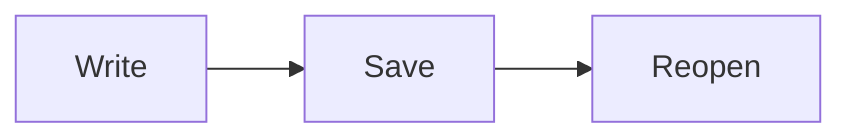

# Markdown workflow

中文 **加粗**、*斜体*、~~删除线~~、`a|b` and [reference][guide].

First editable paragraph 中文🙂.

Second editable paragraph 日本語한글.

## Lists and table

- [ ] Pending task
- [x] Finished task
  - Nested **item**

3. Ordered three
4. Ordered four

> Quoted **text**.
>
> - [ ] Quoted task

| Left | Center | Right |
| :--- | :---: | ---: |
| a\|b | **strong** | `c\|d` |
| 二 | ~~old~~ | [guide][guide] |

## Extensions

Repeated footnote[^note] and again[^note].

Inline math $E=mc^2$ and ==highlight==.

$$
\sum_{i=1}^{n} i = \frac{n(n+1)}{2}
$$

> [!tip] A tip
> Body with **formatting**.



```text
literal ~~strike~~, [x], $x$, [[Target]] and [link](Target.md)
```

## Links

[Local heading](#lists-and-table), [target](Target.md#destination), [[Target]], .

[^note]: A **formatted** footnote with a [reference][guide].

[guide]: https://example.com/guide "Guide"
